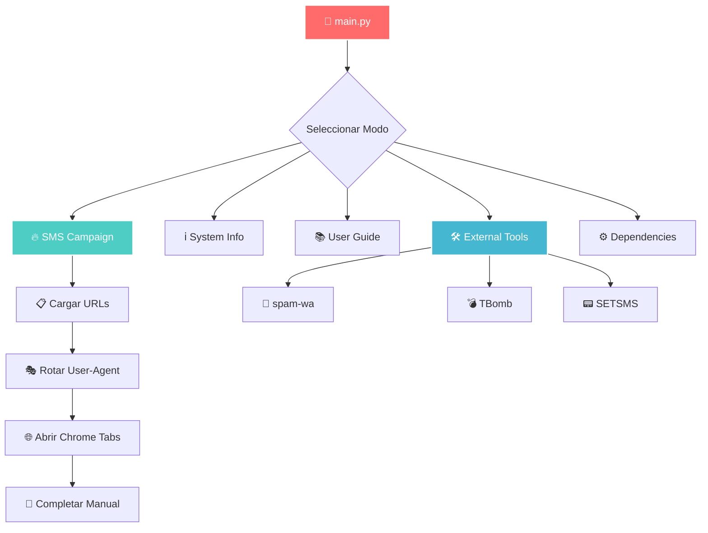

# <div align="center">💀 **DarK SMS Framework** 💀</div>

<div align="center">

```
 ██████╗  █████╗ ██████╗ ██╗  ██╗    ███████╗███╗   ███╗███████╗
 ██╔══██╗██╔══██╗██╔══██╗██║ ██╔╝    ██╔════╝████╗ ████║██╔════╝
 ██║  ██║███████║██████╔╝█████╔╝     ███████╗██╔████╔██║███████╗
 ██║  ██║██╔══██║██╔══██╗██╔═██╗     ╚════██║██║╚██╔╝██║╚════██║
 ██████╔╝██║  ██║██║  ██║██║  ██╗    ███████║██║ ╚═╝ ██║███████║
 ╚═════╝ ╚═╝  ╚═╝╚═╝  ╚═╝╚═╝  ╚═╝    ╚══════╝╚═╝     ╚═╝╚══════╝
```

### **🔥 FRAMEWORK DE AUTOMATIZACIÓN MANUAL DE SMS 🔥**
### **🎯 INVESTIGACIÓN ÉTICA Y EDUCATIVA | CÓDIGO ABIERTO | PYTHON 3.8+**

**Version 1.0** | **MIT License** | **Active Development** | **Cross-Platform**

**[🌟 Visitar Repositorio](https://github.com/BrandonMieres/DarKSMS)** • **[📖 Documentación](#-documentación)** • **[🚀 Instalación](#-instalación-rápida)** • **[⚖️ Uso Ético](#️-disclaimer-legal)**

---

</div>

## 🎯 **DESCRIPCIÓN GENERAL**

> **DarK SMS Framework** es una herramienta de investigación avanzada diseñada para el análisis ético de sistemas de verificación SMS y OTP. Automatiza únicamente la apertura de páginas web mientras mantiene la intervención manual del usuario para completar formularios.

<div align="center">

<table>
<tr>
<td align="center" width="50%">

### 🛡️ **OPERACIONES SILENCIOSAS**
```yaml
✦ Rotación aleatoria de User-Agent
✦ ChromeDriver indetectable
✦ Automatización multi-pestaña
✦ Integración con herramientas externas
```

</td>
<td align="center" width="50%">

### 🔧 **HERRAMIENTAS AVANZADAS**
```yaml
✦ Entorno virtual aislado
✦ Diseño modular y extensible
✦ CLI profesional
✦ Soporte multiplataforma
```

</td>
</tr>
</table>

</div>

### 🔍 **Características Principales**

<details>
<summary><b>🎭 Sistema de Sigilo Avanzado</b></summary>

- **User-Agent Rotation**: Base de datos con 100+ firmas de navegadores
- **Undetected ChromeDriver**: Evasión automática de detección
- **Session Isolation**: Cada pestaña opera independientemente
- **Randomized Timing**: Simula comportamiento humano natural

</details>

<details>
<summary><b>🔧 Arquitectura Modular</b></summary>

- **Core SMS Engine**: Automatización de apertura de páginas
- **Virtual Environment**: Gestión automática de dependencias  
- **External Tools**: Integración con herramientas de terceros
- **CLI Interface**: Interfaz profesional de línea de comandos

</details>

<details>
<summary><b>🌐 Compatibilidad Universal</b></summary>

- **Windows**: Full support con Git Bash/WSL
- **Linux**: Soporte nativo completo
- **macOS**: Compatibilidad total
- **Termux**: Soporte para Android

</details>

---

## 📁 **ARQUITECTURA DEL FRAMEWORK**

```
DarK SMS Framework/
├── 🎯 main.py                      # ┌─ Punto de entrada principal
├── 📦 modules/                     # │
│   ├── 🔥 sms.py                   # ├─ Motor de apertura automática SMS
│   ├── ⚙️ adicional.py             # ├─ Gestor de herramientas externas
│   ├── 📱 spam-wa.py               # ├─ Módulo OTP WhatsApp (externo)
│   ├── 🛠️ install.py               # ├─ Gestor de entorno virtual
│   ├── 🛠️ run.py                  # ├─ Sistema de recuperación
│   ├── 🎭 ua.txt                   # ├─ Base de datos User-Agents
│   └── 📚 __pycache__/             # └─ Caché Python (auto-generado)
├── 🧰 herramientas/                # ┌─ Repositorio herramientas externas
│   ├── 🚀 TBomb/                   # ├─ SMS/Call bombing tool
│   ├── 📟 SETSMS/                  # └─ Sistema automático SMS
└── 📝 README.md                    # ── Documentación del proyecto
```

<div align="center">

### 🎨 **FLUJO DE TRABAJO**



</div>

---

## 🚀 **INSTALACIÓN RÁPIDA**

### ✅ **Requisitos del Sistema**

<div align="center">

| Componente | Versión | Estado | Descripción |
|------------|---------|--------|-------------|
| **Python** | 3.8+ | 🟢 Requerido | Runtime principal |
| **Chrome** | Última | 🟢 Requerido | Para undetected_chromedriver |
| **Git** | Última | 🟡 Opcional | Para clonar repositorio |
| **Admin Rights** | - | 🟠 Windows | Creación de entornos virtuales |

</div>

### 📦 **Métodos de Instalación**

<div align="center">

<table>
<tr>
<td width="50%">

#### **Método 1: Git Clone**
```bash
# Clonar repositorio
git clone https://github.com/BrandonMieres/DarKSMS.git

# Navegar al directorio
cd DarKSMS

# Ejecutar framework
python main.py
```

</td>
<td width="50%">

#### **Método 2: Descarga Directa**
```bash
# 1. Descargar desde GitHub
# 2. Extraer archivo ZIP
# 3. Navegar al directorio DarKSMS/

# Ejecutar framework
python main.py
```

</td>
</tr>
</table>

</div>

<details>
<summary><b>🔧 Configuración Automática del Entorno</b></summary>

El framework configura automáticamente:

```bash
# Creación de entorno virtual
python -m venv venv

# Activación automática
# Windows: .\venv\Scripts\activate
# Linux/macOS: source venv/bin/activate

# Instalación de dependencias
pip install colorama undetected-chromedriver setuptools
```

**Dependencias instaladas:**
- `colorama`: Colores en terminal
- `undetected-chromedriver`: Chrome automation
- `setuptools`: Herramientas de configuración

</details>

---

## 📖 **GUÍA DE USO COMPLETA**

### 🖥️ **Interfaz Principal**

Al ejecutar `python main.py`, verás:

```
============================================================
📋 MENÚ PRINCIPAL
============================================================
  [1] 🌐 Abrir páginas (Chrome con User-Agent aleatorio)
  [2] ℹ️  Información de la herramienta
  [3] 📖 Cómo usar
  [4] 🛠️  Herramientas adicionales
  [5] 📦 Instalar dependencias
  [99] 🚪 Salir
============================================================
┌─[DarK-SMS]─[Main-Menu]
└──╼
```

### 🎯 **Modos de Operación Detallados**

<div align="center">

<table>
<tr>
<th width="20%">Modo</th>
<th width="40%">Descripción</th>
<th width="40%">Funcionalidad</th>
</tr>
<tr>
<td align="center">

**🚀 Campaña SMS**

</td>
<td>

Automatiza la apertura de URLs de verificación SMS en pestañas de Chrome con User-Agents aleatorios

</td>
<td>

• Solicita archivo de URLs (ej: `sms1.txt`)  
• Abre pestañas automáticamente  
• **Usuario completa formularios manualmente**  
• Rotación automática de User-Agent

</td>
</tr>
<tr>
<td align="center">

**ℹ️ Info Sistema**

</td>
<td>

Muestra información detallada del framework, versión y compatibilidad del sistema

</td>
<td>

• Especificaciones técnicas  
• Estado de dependencias  
• Información de compatibilidad  
• Limitaciones conocidas

</td>
</tr>
<tr>
<td align="center">

**📚 Guía de Uso**

</td>
<td>

Tutorial interactivo paso a paso para usar correctamente el framework

</td>
<td>

• Configuración inicial  
• Ejemplos de uso  
• Mejores prácticas  
• Solución de problemas

</td>
</tr>
<tr>
<td align="center">

**🛠️ Herramientas**

</td>
<td>

Gestiona e instala herramientas externas adicionales de terceros

</td>
<td>

• `spam-wa`: Automatización OTP WhatsApp  
• `TBomb`: SMS/Call bombing  
• `SETSMS`: Sistema automático SMS  
• Clonación automática

</td>
</tr>
<tr>
<td align="center">

**⚙️ Dependencias**

</td>
<td>

Verifica e instala todas las dependencias necesarias en el entorno virtual

</td>
<td>

• Verificación de entorno  
• Instalación automática  
• Recuperación de errores  
• Validación de componentes

</td>
</tr>
</table>

</div>

### 🌐 **Uso de Abrir páginas (sms.py)**

**Funcionamiento básico:**
- Proporciona un archivo de texto con URLs de verificación SMS
- El sistema abre cada URL en pestañas de Chrome con User-Agents aleatorios
- **El usuario debe completar manualmente los formularios** para enviar SMS

**Formato de archivo requerido:**
```text
https://example.com/verify?phone={number}
https://api.service.com/sms/send?to={number}
```
*Nota: Reemplaza `{number}` con el número objetivo (+1234567890)*

<details>
<summary><b>🎭 Sistema de User-Agent</b></summary>

**Base de datos `ua.txt`** incluye:
- **Desktop**: Chrome, Firefox, Safari, Edge
- **Mobile**: Android Chrome, iOS Safari
- **Sistemas**: Windows, macOS, Linux, Android, iOS

**Ejemplo de rotación:**
```text
Mozilla/5.0 (Windows NT 10.0; Win64; x64) AppleWebKit/537.36...
Mozilla/5.0 (Macintosh; Intel Mac OS X 10_15_7) AppleWebKit/537.36...
Mozilla/5.0 (X11; Linux x86_64) AppleWebKit/537.36...
```

⚠️ **Nota**: Las firmas son de ~2015, considera actualizarlas para mejores resultados.

</details>

<details>
<summary><b>🛠️ Herramientas Externas</b></summary>

#### **📱 spam-wa**
- **Función**: Automatización de OTP para WhatsApp
- **Tipo**: Herramienta externa (no desarrollada por el autor)
- **Uso**: API automation para WhatsApp OTP

#### **💣 TBomb**
- **Función**: SMS/Call bombing
- **Limitación**: Solo funciona en India
- **Instalación**: Clonado automáticamente en `herramientas/TBomb`

#### **📟 SETSMS**  
- **Función**: Sistema automático de SMS
- **Requisito**: Bash (Git Bash/WSL en Windows)
- **Instalación**: Clonado automáticamente en `herramientas/SETSMS`

</details>

---

## ⚡ **ESPECIFICACIONES TÉCNICAS**

### 🛡️ **Características de Seguridad**

<div align="center">

<table>
<tr>
<td align="center" width="25%">

**🎭 SIGILO**
```yaml
User-Agent Rotation
Undetected ChromeDriver  
Session Isolation
Randomized Timing
```

</td>
<td align="center" width="25%">

**🔒 AISLAMIENTO**
```yaml
Virtual Environment
Independent Sessions
Sandboxed Execution
Clean Dependencies
```

</td>
<td align="center" width="25%">

**🚀 PERFORMANCE**
```yaml
Multi-tab Support
Async Operations
Resource Optimization
Error Recovery
```

</td>
<td align="center" width="25%">

**🌐 COMPATIBILIDAD**
```yaml
Cross-Platform
Multiple Python Versions
Dependency Management
Auto-Configuration
```

</td>
</tr>
</table>

</div>

### 🧬 **Arquitectura de Componentes**

<details>
<summary><b>🔥 Motor SMS (sms.py)</b></summary>

**Funcionalidades:**
- Automatización de apertura de URLs en Chrome
- Integración con `undetected_chromedriver` para evasión
- Rotación aleatoria de User-Agent desde `ua.txt`
- Gestión de múltiples pestañas simultáneas

**Limitaciones:**
- Solo automatiza la apertura de páginas
- El usuario debe completar formularios manualmente
- Requiere Google Chrome instalado

**Código ejemplo:**
```python
# Pseudocódigo del funcionamiento
chrome_options = configure_stealth_options()
user_agent = random.choice(load_user_agents())
driver = undetected_chromedriver.Chrome(options=chrome_options)
driver.execute_script("Object.defineProperty(navigator, 'userAgent', {get: function(){return arguments[0];}})", user_agent)
```

</details>

<details>
<summary><b>🛠️ Sistema de Instalación</b></summary>

**install.py**:
- Crea entorno virtual aislado
- Instala dependencias automáticamente
- Maneja errores de permisos
- Valida instalación correcta

**run.py**:
- Sistema de recuperación de entorno
- Activación automática de virtual environment
- Detección de problemas de configuración
- Reinstalación en caso de corrupción

</details>

<details>
<summary><b>🎭 Base de Datos User-Agent</b></summary>

**ua.txt** contiene:
- 100+ firmas de navegadores auténticas
- Dispositivos desktop y móviles
- Diferentes sistemas operativos
- Versiones históricas para compatibilidad

**Distribución:**
- Chrome: ~40%
- Firefox: ~25% 
- Safari: ~20%
- Edge/Others: ~15%

</details>

---

### ⚠️ **DISCLAIMER LEGAL Y ÉTICO**

<div align="center">

**🔴 SOLO USO EDUCATIVO** | **🛡️ USO RESPONSABLE** | **⚖️ CUMPLIMIENTO LEGAL REQUERIDO**

</div>

### 🚨 **ADVERTENCIAS CRÍTICAS**

<div align="center">

<table>
<tr>
<td align="center" width="50%">

### ⚖️ **CUMPLIMIENTO LEGAL**
```diff
+ ✅ Solo para uso educativo
+ ✅ Respetar términos de servicio
+ ✅ Sin acceso no autorizado
+ ✅ Cumplir leyes de privacidad
- ❌ No usar para spam/acoso
- ❌ No violar términos de uso
- ❌ No accesos maliciosos
- ❌ No violaciones de privacidad
```

</td>
<td align="center" width="50%">

### 🛡️ **USO RESPONSABLE**
```diff
+ ✅ Entornos de prueba controlados
+ ✅ Consentimiento explícito
+ ✅ Respetar límites de APIs
+ ✅ Mantener límites éticos
- ❌ No spam masivo
- ❌ No acoso/hostigamiento
- ❌ No explotación comercial
- ❌ No actividades maliciosas
```

</td>
</tr>
</table>

</div>

### 📋 **DESCARGO DE RESPONSABILIDAD**

> **⚠️ IMPORTANTE**: DarK SMS Framework ha sido desarrollado exclusivamente para fines educativos y de investigación en ciberseguridad. Los desarrolladores no asumen ninguna responsabilidad por el mal uso de esta herramienta, actividades ilegales, o violaciones de términos de servicio de terceros.

#### **🚫 ACTIVIDADES PROHIBIDAS**
- Envío de SMS/OTPs sin consentimiento explícito
- Acoso, hostigamiento o spam masivo
- Explotación comercial no autorizada
- Violación de términos de servicio o leyes de privacidad
- Actividades que puedan causar daño o molestias

#### **✅ PRÁCTICAS RECOMENDADAS**
- Usar únicamente en entornos de prueba éticos y controlados
- Obtener consentimiento explícito de todas las partes involucradas
- Respetar los límites de tasa de APIs y servicios
- Documentar todas las actividades de investigación
- Mantener la confidencialidad y privacidad de datos

### 🔐 **CONSIDERACIONES DE SEGURIDAD**

<details>
<summary><b>🛡️ Protección de Datos</b></summary>

- **No almacenar datos sensibles**: El framework no debe usarse para recopilar información personal
- **Cifrado de comunicaciones**: Usar HTTPS siempre que sea posible
- **Logs seguros**: No registrar números de teléfono o datos personales
- **Limpieza de sesiones**: Limpiar datos de navegador después del uso

</details>

<details>
<summary><b>⚖️ Compliance Legal</b></summary>

- **GDPR**: Cumplimiento con regulaciones europeas de protección de datos
- **CCPA**: Respeto a las leyes de privacidad de California
- **Leyes locales**: Verificar regulaciones específicas por jurisdicción
- **Términos de servicio**: Revisar y cumplir ToS de servicios utilizados

</details>

---

## 🤝 **CONTRIBUCIÓN Y DESARROLLO**

### 🎯 **Cómo Contribuir**

<div align="center">

<table>
<tr>
<td align="center" width="25%">

**🐛 BUGS**
```yaml
Reportes detallados
Pasos para reproducir
Logs de error
Información del sistema
```

</td>
<td align="center" width="25%">

**💡 FEATURES**
```yaml
Enfoque educativo
Mejoras de seguridad
Optimizaciones
Documentación
```

</td>
<td align="center" width="25%">

**🔧 CODE**
```yaml
Pull requests
Código limpio
Testing
Cumplimiento ético
```

</td>
<td align="center" width="25%">

**📚 DOCS**
```yaml
Guías claras
Ejemplos prácticos
Traducciones
Tutoriales
```

</td>
</tr>
</table>

</div>

### 🛣️ **Información de Desarrollo**

**Estado actual**: Framework funcional y estable para uso educativo
**Próximas mejoras**: Actualizaciones de seguridad y optimizaciones continuas

---

## 📞 **SOPORTE Y RECURSOS**

### 🔗 **Enlaces Importantes**

<div align="center">

**[📂 GitHub Repository](https://github.com/BrandonMieres/DarKSMS)** • **[🐛 Bug Reports](https://github.com/BrandonMieres/DarKSMS/issues)** • **[🔧 Pull Requests](https://github.com/BrandonMieres/DarKSMS/pulls)** • **[📚 Wiki](https://github.com/BrandonMieres/DarKSMS/wiki)**

</div>

### 📞 **Canales de Soporte**

- **🐛 Bug Reports**: [GitHub Issues](https://github.com/BrandonMieres/DarKSMS/issues)
- **💡 Feature Requests**: [GitHub Discussions](https://github.com/BrandonMieres/DarKSMS/discussions)
- **🔧 Pull Requests**: [GitHub PRs](https://github.com/BrandonMieres/DarKSMS/pulls)
- **📚 Documentation**: [GitHub Wiki](https://github.com/BrandonMieres/DarKSMS/wiki)

### ❓ **FAQ**

<details>
<summary><b>¿Por qué necesito completar los formularios manualmente?</b></summary>

El framework está diseñado para fines educativos y de investigación ética. La automatización completa de formularios podría facilitar el spam, por lo que mantenemos la intervención humana como medida de seguridad.

</details>

<details>
<summary><b>¿Es legal usar este framework?</b></summary>

El framework es legal cuando se usa para fines educativos y de investigación ética. Sin embargo, el uso para spam, acoso o violación de términos de servicio puede ser ilegal según tu jurisdicción.

</details>

<details>
<summary><b>¿Funciona en todos los países?</b></summary>

Las herramientas externas como TBomb tienen limitaciones geográficas (solo India). El core del framework funciona globalmente, pero respeta las leyes locales.

</details>

---

## 💚 **AGRADECIMIENTOS 💚**

<div align="center">

<div align="center">

### 💚 **AGRADECIMIENTOS 💚**

### 👨‍💻 **Desarrollado por DarK**

**Framework Version 1.0** | **Ethical Hacking Community**

*Agradecimientos especiales a la comunidad de investigadores en ciberseguridad por promover prácticas éticas y educativas*

### 🌟 **Muestra Tu Apoyo**

Si DarK SMS Framework ha sido útil para tu investigación o aprendizaje:

- ⭐ **Dale una estrella al repositorio**
- 📤 **Comparte el proyecto con otros investigadores**
- 🔔 **Sigue las actualizaciones en GitHub**
- 🤝 **Contribuye con mejoras o reporta bugs**

---

💛

</div>
